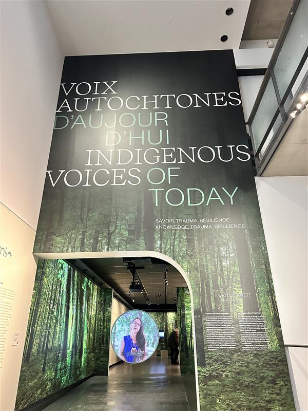
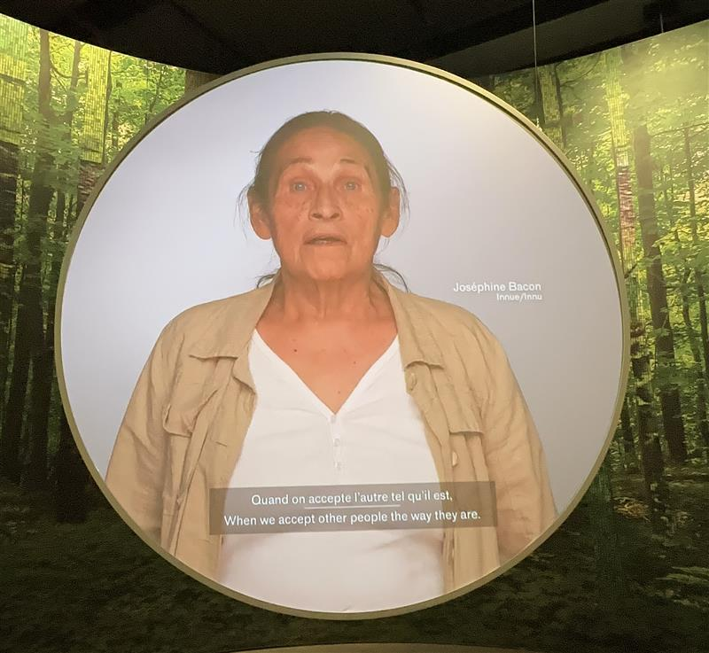
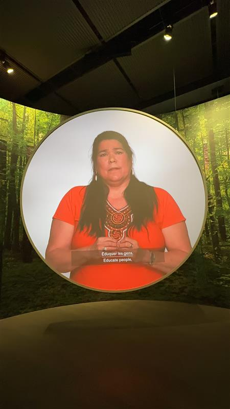
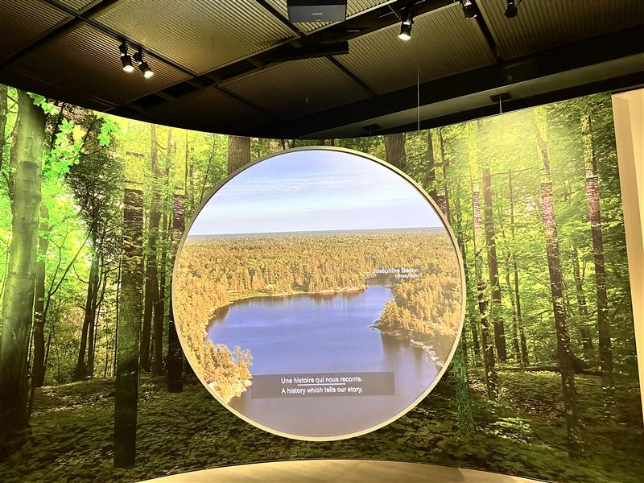
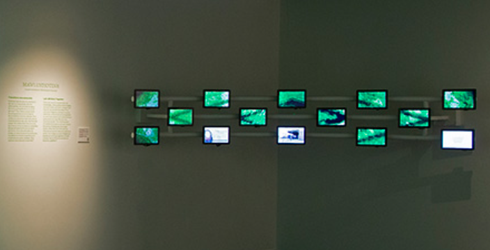

# Wampum Numérique

## Informations
* Type d'expositions: intérieur
* Date de visite: 18 avril 2024 et 28 avril 2024
* Type d'installation: non intéractif pour la dernière section d'exposition.

## Voix Autochtones
Pour aller à le Musée, il y a un gros Inukshuk juste près de le bâtiment.

Voix autochtones d'aujourd'hui : Savoir, traumatisme, résilience est une exposition permanente depuis le 25 septembre 2021. 
Elisabeth Kaine, conservatrice de Huron-Wandatt, avait créé cette exposition qui comprend certaines artifacts et de témoignanges de membres des 11 autochtones du Québec. La collection Culture autochtones du Musée McCord à soixantaine d'objets qui illustrent plusieurs thèmes, dont le nomadisme, la valeur de la chasse et de la pêche, la spiritualité et le rôle d'un enfant.

## Deuxième partie
Le public est invité à participer à un voyage en trois parties qui met en lumière la sagesse, les traumatismes et l'extraordinaire résilience des peuples autochtones. La zone aborde des questions importantes telles que la pauvreté, l'injustice à l'égard des alloctones, la loi sur les Indiens et la perte des enfants et de leur langue maternelle.
Cette exposition me donne un sentiment de paix et de douleur en même temps, mais ça me guérit parce que j'ai aussi appris de ce qu'ils on vécus dans le passée. 

## Troisième partie
Narration en français et en innu par Joséphine Bacon, elle est une femme extraordinaire, elle à beaucoup à raconter.
Il y avait aussi d'autres autochtones qui parlait dans le vidéo.

# HEURES D'OUVERTURE DU MUSÉE ET TARIFS
Quand je suis allée, j'avais pris l'avance d'acheter un billet pour aller visiter le musée pour la section d'Autochtones, mais quand je suis rentrée, c'était gratuit pour moi.

Mardi, jeudi et vendredi de 10 h à 18 h. | Mercredi de 10 h à 21 h | Samedi et dimanche de 10 h à 17 h
Adultes : 19 $ | Aînés : 17 $| Étudiants (13 à 30 ans) : 14 $ | 12 ans et moins : gratuit | Autochtones : gratuit |

C'était une belle expérience, j'y retourner plusiueurs fois. Ça me donne le réconfort et je peux aussi éduquer les gens qui ne sont pas au courant des peuples autochtones et de ce que mes ancêtres ont dû endurer. Je recommend fortement à des gens de visiter cette exposition.

## Liens vers le site web de McCord
<https://www.musee-mccord-stewart.ca/fr/expositions/voix-autochtones-aujourdhui/>
